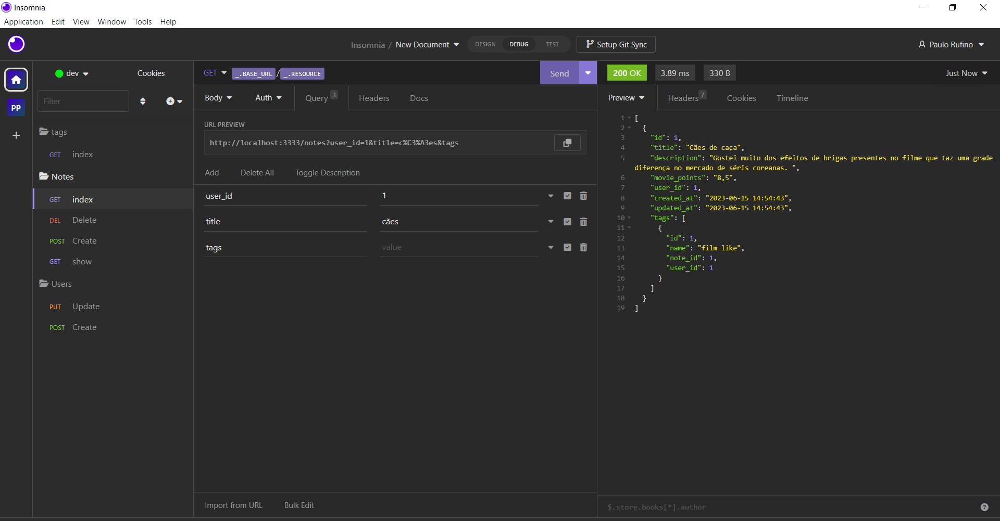

# Explorer Rocketseat "BACKEND"

> Trinha explorer

Projeto construido no Stage 08 da Rocketseat.

> Minha primeira vez criando um projeto com Backend. 🛠️

## 🤖 tecnologias

- NODE.JS
- SQL
- SQL QUERY BUILDER
- HTTP
- GIT E GITHUB

## Mais um projeto encrivevel ! 🦾

## 👾Contato

paulohrufino600@gmail.com